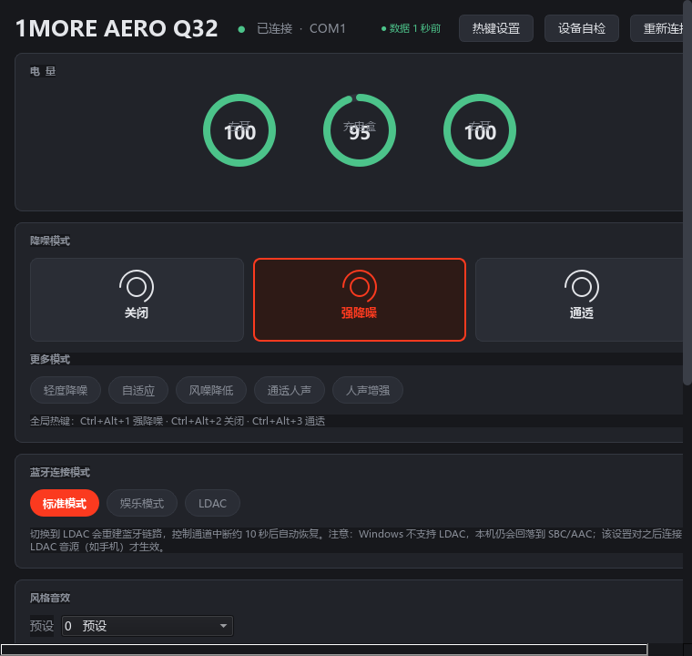

# AERO Q32 Console

> 把 **1MORE AERO Q32** 的官方安卓伴侣应用，在 Windows 上原生重写了一遍。
> 不用掏手机，就能看电量、切降噪、调音效。



<div align="center">

`Python 3.9+` · `Windows 10/11` · `MIT` · 非官方项目

</div>

> ### ⚠️ 先读这个，再动手
>
> **只有 1MORE AERO Q32 是完整验证的。这不是通用蓝牙耳机工具。**
> 同品牌的 S20 Pro 属于同一协议族的**小端变体**，目前仅支持只读（电量）。
>
> 能否使用取决于两个**硬性条件**（标准 SPP 串口 + 同一套命令协议），缺一不可 ——
> 详见 [兼容性](#兼容性)。同品牌的其他型号也按型号分叉，其他品牌基本不可用。
>
> 换设备前请先跑一分钟自检，别浪费时间去调。

---

## 这是什么

这个项目的耳机官方伴侣 App **只有安卓版**。我把它在 Windows 上原生重写了一遍，让你
**不用掏出手机**就能：

- 看左右耳和充电盒的实时电量
- 切换 8 种降噪模式（含全局热键）
- 调整风格音效、切换连接模式（标准 / 娱乐 / LDAC）
- 托盘常驻，右键就能操作

它通过蓝牙 SPP（串口）与耳机通信。协议是我**观察本机与耳机之间的链路、并在实机上逐条
验证**整理出来的，[完整协议文档在这里](docs/PROTOCOL.md)。

本项目是**独立的第三方实现**，与耳机厂商没有任何关系。详见 [NOTICE.md](NOTICE.md)。

---

## 功能

| 功能 | 说明 |
|---|---|
| **电量** | 左耳 / 充电盒 / 右耳，圆环动画显示 |
| **降噪** | 8 种模式，3 个大按钮 + 5 个快捷标签 |
| **风格音效** | 独立的声效预设，与降噪互不影响 |
| **连接模式** | 标准 / 娱乐 / LDAC |
| **全局热键** | 可完全自定义，默认 Ctrl+Alt+1/2/3 |
| **托盘常驻** | 关窗口最小化到托盘，右键直接切模式 |
| **设备自检** | 只发只读命令，探测你这台设备支持哪些功能 |
| **原始命令控制台** | 带安全闸的调试入口（详见下文） |
| **低电量提醒** | 低于阈值弹托盘通知 |
| **环境诊断** | 一条命令输出排障所需全部信息 |

---

## 环境要求

- Windows 10 / 11（64 位）
- Python 3.9 或更高
- 耳机**已在系统蓝牙设置里完成配对**

> Windows 会在配对后为该耳机的 SPP 服务创建一个虚拟串口。本项目通过**设备硬件 ID**
> 自动识别这个端口，从不猜 COM 号，所以换电脑、重新配对都不会连错。
>
> **⏳ 首次连接可能要等十几秒。** Windows 打开蓝牙串口是**瞬间返回**的，但底层 RFCOMM
> 链路此时还没建立 —— 实测某设备要 **6 秒以上**才通，这期间发出去的数据全部丢失。
> 程序会在 10 秒窗口内反复重试握手，所以看到「正在建立蓝牙链路」时请耐心等，
> 不要以为卡死了。

---

## 安装

```bash
git clone https://github.com/<你的用户名>/aero-q32-console.git
cd aero-q32-console
pip install -r requirements.txt
```

只想要命令行、不要图形界面：

```bash
pip install pyserial    # 不需要 PySide6
```

---

## 使用

### 图形界面

```bash
python app.py
```

### 命令行

```bash
python aero_cli.py doctor           # 环境诊断（出问题先跑这个）
python aero_cli.py battery          # 查看电量
python aero_cli.py mode             # 查询降噪模式
python aero_cli.py mode strong      # 切换降噪模式
python aero_cli.py sound 5          # 设置风格音效
python aero_cli.py connect ldac     # 切换连接模式
python aero_cli.py probe            # 探测设备支持哪些命令（只读）
python aero_cli.py json             # 输出 JSON，方便脚本消费
```

**退出码**：`0` 成功 · `1` 出错 · `2` 未找到设备 · `3` 被安全闸拦截

**降噪别名**：`off` `strong` `mild` `transparent` `wnr` `passthrough` `voice` `adaptive`

**连接别名**：`standard` `entertainment` `ldac`

可选参数：`--port COM6` 指定串口 · `--mac AABBCCDDEEFF` 指定设备

### 便携模式（绿色版）

```bat
set AEROQ32_DATA_DIR=%~dp0data
python app.py
```

配置和日志放在程序目录，不写 `%LOCALAPPDATA%`。

---

## 配置

配置文件位于 `%LOCALAPPDATA%\AeroQ32\settings.json`：

```json
{
  "hotkeys": [
    {"mode": 1, "ctrl": true, "alt": true, "shift": false, "key": "1"},
    {"mode": 0, "ctrl": true, "alt": true, "shift": false, "key": "2"},
    {"mode": 3, "ctrl": true, "alt": true, "shift": false, "key": "3"}
  ],
  "low_battery": 20,
  "heartbeat_sec": 60
}
```

界面右上角「热键设置」可以直接改，不用手写 JSON。

---

## 兼容性

### 两个硬性条件，缺一不可

| | 条件 | 不满足会怎样 |
|---|---|---|
| **① 传输层** | 控制通道必须挂在**标准 SPP UUID** `00001101-...` 上，Windows 才会为它创建虚拟串口 | 厂商私有 UUID（例如 `JL_SPP` 的 `EDF00000-EDFE-DFED-FEDF-EDFEDFEDFEDF`）**根本没有串口**，本工具碰不到 |
| **② 协议层** | 设备必须说**这套 `11 01 00 ...` 帧协议** | 有串口也白搭 —— 设备在上面不应答 |

### 实测结果

| 设备 | 结果 |
|---|---|
| **1MORE AERO Q32** | ✅ 电量 / 8 种降噪 / 连接模式 / 风格音效 全部可用 |
| **1MORE S20 Pro**（耳夹式） | ⚠️ **只读**：电量能读，写命令已禁用（原因见下） |
| **漫步者花再 Zero Buds** | ❌ 虽然是杰理芯片，但控制通道在私有 UUID（`JL_SPP`）上，且使用另一套协议 |

### 同一品牌也会"方言不同"

S20 Pro 能应答这套协议，但外层封装是另一套写法：

| | AERO Q32 | S20 Pro |
|---|---|---|
| 16 位字段 | 大端 | **小端** |
| 尾字段 | `00 01` | `01 00` |
| 第 8 字节 | `XOR(前 8 字节)` | **不是校验和** |

第 8 字节至今没破解：256 个 CRC-8 多项式 × 初值 0x00/0xFF × 位反转 × 9 种取值范围，
再加上求和、异或、取反，**全部不匹配**。而且同一条 `0x4E` 的应答恒为 `0x89`，
设备**主动推送**的同类帧却是 `0x3f` —— 同样的内容、不同的值，所以它更像是标记
"这帧是谁发的"，而不是校验内容。

**因为这个字节没法校验，小端变体只能靠结构来定帧**（固定前 3 字节 + 尾字段 + 合理长度）。
这比真校验和弱，所以本工具对该变体**只读**：能答上来的查询照常读，写命令一律拦住。

> 拦住写命令的理由：设备**能正确应答**我们的请求帧，只说明读的方向没问题；
> 反方向的请求格式对不对，没验证过 —— 它可能只是忽略了不需要的字段。
> 去验证意味着往一副没法替换的真耳机里写数据，这个风险不对等。

> 另外，S20 Pro 是**耳夹式开放结构，没有降噪硬件**，`0x5F` 不回应是正常的，不是协议故障。

### 为什么"同样是杰理芯片"也不能保证可用

本项目的命令表（`CMD_GET_LISTEN_MODE`、`CMD_SET_EARPHONE_EQ`…）是 **1MORE 自己的应用层协议**，
不是芯片级的。杰理 SDK 只提供底层串口通道和固件升级能力。

打个比方：**杰理提供电话线，1MORE 在上面说了自己的暗语。** 别的品牌用同一家电话公司，
说的是另一套暗语。

### 一分钟判断你的设备行不行

```bash
python aero_cli.py doctor    # ① 有没有"远端设备口"
python aero_cli.py probe     # ② 设备应不应答（只发只读命令，安全）
```

| `doctor` 显示 | `probe` 结果 | 结论 |
|---|---|---|
| 有远端设备口 | **有应答** | ✅ 能用 |
| 有远端设备口 | 全无应答 | ❌ 传输或协议不匹配 |
| 只有本机传入口 | — | ❌ 未配对，或该型号不开放 SPP |

> **口诀：`doctor` 看到端口不算数，`probe` 有应答才算数。**

详细说明与已知边界见 [docs/COMPATIBILITY.md](docs/COMPATIBILITY.md)。

---

## ⚠️ 安全说明

### 原始命令控制台

界面里的「原始命令」卡片可以直接发送任意命令帧。它有一道**硬性安全闸**：

| 类别 | 处理 |
|---|---|
| 固件刷写 / 不可逆删除类命令 | **永久拦截**，即使勾选"解锁"也照样拦截，代码里没有绕过路径 |
| 只读查询命令 | 始终放行 |
| 本项目实测验证过的写命令 | 放行 |
| 其它未知命令 | 默认拦截，需手动解锁 |

**请不要用它刷固件。** 用逆向出来的协议刷固件可能让耳机永久变砖。升级固件请用官方 App。

### 其它

- 本项目**没有任何网络代码**，不收集、不上传任何数据
- 只在本地写入两个文件：`settings.json` 和 `logs/aero_q32.log`

---

## 常见问题

<details>
<summary><b>一直显示"正在建立蓝牙链路"，或者反复搜索找不到耳机</b></summary>

**最常见的原因：链路需要的时间比你预期长。** Windows 打开蓝牙串口是瞬间返回的，
但底层 RFCOMM 连接要几秒才通（实测 **6.2 秒**），这期间写出的数据会静默丢失。

当前版本已经会在 10 秒内反复重试握手，**请先等满十几秒再下结论**。

如果始终连不上，检查你的型号是不是用的**厂商私有 SPP 服务**：

```bash
python aero_cli.py ports
```

再去设备管理器（或 `Get-PnpDevice`）看该设备的服务列表，找有没有非标准的服务名 ——
例如 `JL_SPP` 绑定到 `EDF00000-EDFE-DFED-FEDF-EDFEDFEDFEDF` 这样的 UUID。

**Windows 只为标准 SPP（`00001101-...`）创建 COM 口**，私有 UUID 没有串口可达，
本工具碰不到。这属于传输层不匹配，不是 bug。
详见 [docs/COMPATIBILITY.md](docs/COMPATIBILITY.md)。
</details>

<details>
<summary><b>提示找不到耳机 / 未找到可应答的串口</b></summary>

先跑 `python aero_cli.py doctor`，它会告诉你具体是哪种情况。

- 只有本机传入口（硬件 ID 含 `LOCALMFG`）→ 耳机没配对，或该型号不提供 SPP
- 完全没有任何蓝牙串口 → 蓝牙没开 / 没配对 / 适配器用的是第三方驱动栈
- **有远端设备口但设备不应答** → 要么是私有 UUID 的传输，要么协议不同
  （跑 `python aero_cli.py probe` 确认）

第三方驱动栈是常见原因，在设备管理器里把蓝牙适配器换成微软自带驱动即可。
</details>

<details>
<summary><b>提示「串口被占用」</b></summary>

多半是**另一个副本还在后台跑着**。看右下角托盘图标，右键选「退出」。
桌面窗口关了不代表程序退出了——它会最小化到托盘。
</details>

<details>
<summary><b>切了降噪模式但好像没生效</b></summary>

两种情况是**设备的正常行为**，不是故障：

1. 模式切换是异步的，立刻回读可能读到旧值（程序会自动轮询直到稳定）
2. 「风噪降低」是降噪的子模式——降噪关着的时候设它是无效的，设备会自己退回

程序会在日志里如实写明「设备未采纳」，不会假装成功。
</details>

<details>
<summary><b>切到 LDAC 后断连十几秒</b></summary>

正常现象。切换连接模式会重建 A2DP 链路，控制通道随之中断约 10 秒，程序会自动重连。

另外 **Windows 本身不支持 LDAC**，在电脑上切这个选项不会提升本机音质；
该设置存在耳机里，等它之后连 LDAC 音源（比如手机）时才生效。
</details>

<details>
<summary><b>电量数字偶尔跳来跳去</b></summary>

每次电量变化都会把**原始报文**写进日志，方便定位：

```
%LOCALAPPDATA%\AeroQ32\logs\aero_q32.log
```

如果报文结构和 [协议文档](docs/PROTOCOL.md) 描述的不一样，欢迎开 issue 附上那一行。
充电盒电量字节还没有在多种充电状态下验证过。
</details>

更多问题见 [docs/TROUBLESHOOTING.md](docs/TROUBLESHOOTING.md)。

---

## 项目结构

```
aero_q32.py      协议 + 传输 + 安全闸 + 配置   （不依赖 Qt，可单独使用）
app.py           PySide6 图形界面
aero_cli.py      命令行入口
tests/           无需硬件的自动化测试
docs/            协议文档 / 兼容性 / 排障
```

协议层刻意做成**不依赖界面框架**的，所以可以在没有显示器、没有耳机的情况下完整测试。

---

## 参与贡献

欢迎 PR 和 issue，尤其是**设备兼容性上报**——我没有别的型号可以测。

上报时请附上：

```bash
python aero_cli.py doctor    # 环境信息
python aero_cli.py probe     # 设备支持哪些命令（只读，安全）
```

⚠️ **本项目不接受任何厂商二进制或反编译产物**（`.apk` / `.dex` / 反编译源码 / 固件镜像）。
详见 [NOTICE.md](NOTICE.md) 和 [CONTRIBUTING.md](CONTRIBUTING.md)。

---

## 许可证

[MIT](LICENSE)

## 免责声明

本项目为**独立第三方实现**，与任何耳机厂商均无隶属、授权或背书关系。
所有产品名称与商标归各自所有者，此处仅用于**标识兼容性**。

软件按「原样」提供，不附带任何担保。使用风险自负，尤其是原始命令控制台。

---

---

## English

**A Windows rewrite of the 1MORE AERO Q32 companion app.** Read battery levels, switch ANC
modes and change sound presets without reaching for your phone.

> ### Scope — read this first
>
> **Only the 1MORE AERO Q32 has been verified. This is not a universal earbud tool.**
>
> Two hard requirements must both hold: the control channel must sit on the **standard SPP
> UUID** (`00001101-...`, so Windows creates a COM port), and the device must speak **this
> frame protocol**. Same-brand models differ; other brands generally will not work.

The vendor companion app is Android-only. This project reimplements the same device control
natively on Windows over the Bluetooth SPP link, with a documented protocol.

```bash
pip install -r requirements.txt
python app.py                  # GUI
python aero_cli.py doctor      # diagnostics (start here if something is wrong)
python aero_cli.py battery     # battery levels
python aero_cli.py probe       # which commands your device answers (read-only)
```

### Quick compatibility check

| `doctor` shows | `probe` returns | Verdict |
|---|---|---|
| a remote device port | any replies | works |
| a remote device port | no replies at all | transport or protocol mismatch |
| only a local incoming port | - | not paired, or the model does not expose SPP |

> Seeing a COM port is not enough — the device must actually answer. Some models use a
> **vendor-specific SPP UUID** instead of the standard one; Windows creates no COM port for
> those, so this tool cannot reach them.

### Notes

* Windows 10/11, Python 3.9+. Earbuds must already be **paired** in Windows.
* **The first connection can take over ten seconds.** Opening a Bluetooth serial port returns
  instantly, but the RFCOMM link behind it may take 6+ seconds to come up; data written during
  that window is dropped. Discovery retries the handshake for up to 10 seconds.
* The serial port is discovered from the device hardware ID - never a hard-coded COM number.
* Fully verified: 1MORE AERO Q32. Partially verified (read-only, little-endian frame variant):
  1MORE S20 Pro. Not verified: anything else.
* Firmware-flashing and irreversible-delete commands are **hard-blocked in code**, even when
  the raw console is unlocked.

This is an **unofficial project**, not affiliated with or endorsed by any vendor.
See [NOTICE.md](NOTICE.md). Licensed under [MIT](LICENSE).